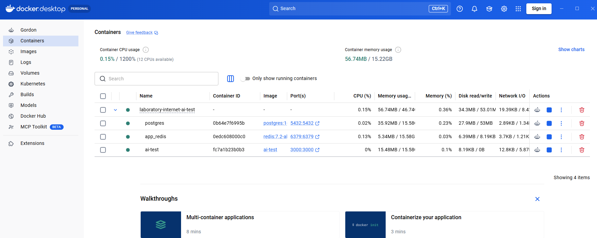
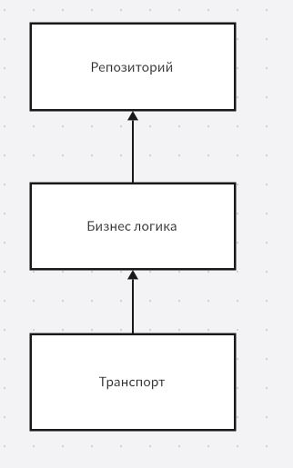
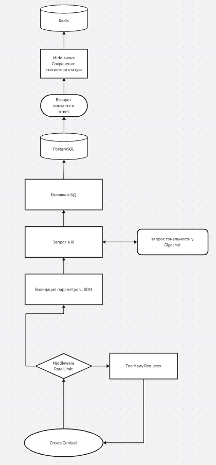
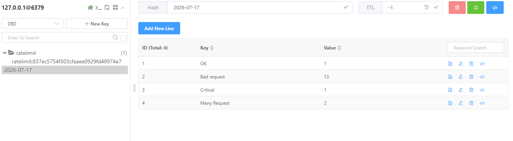
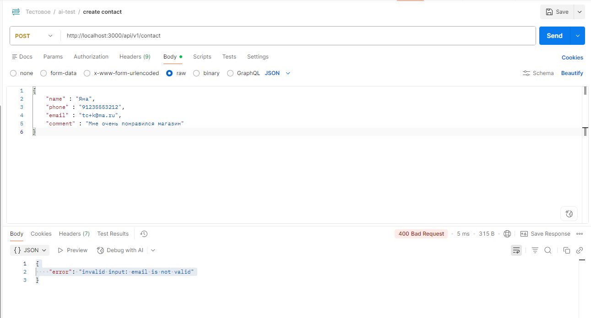
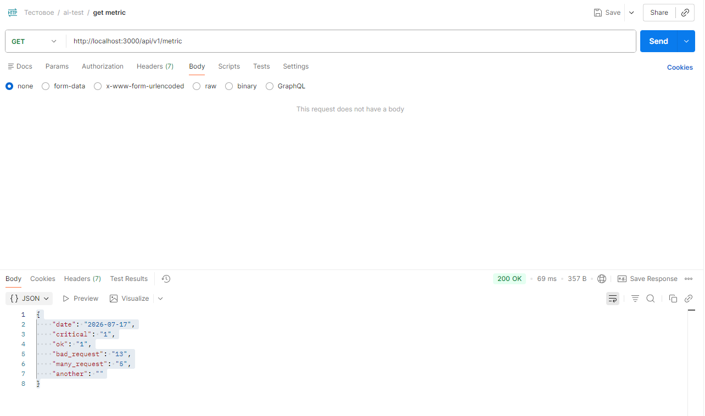
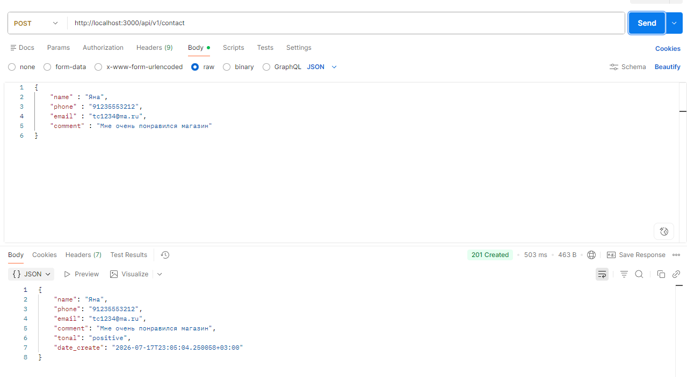
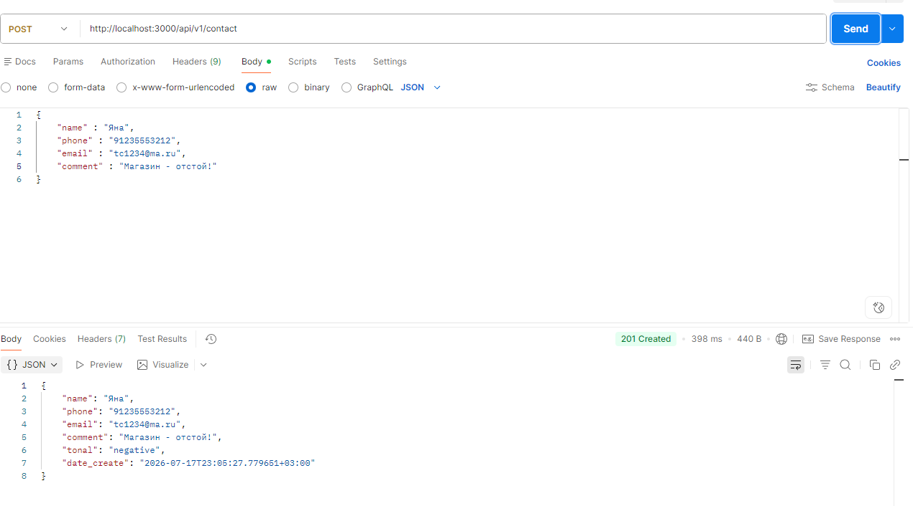

# laboratory-internet-ai-test


Отправку письма на Email реализовать не успел. Реализовывал сервисы, которые отправляли письмо
на почту при регистрации пользователя, поэтому имею представление как это работает.

## 1) Как запустить проект

 Для запуска нужен Docker. В папке с проектом ввести команду:

 ```docker compose up -d```
 

 Переменные окружения(env) хранятся в ./config/env/.env
 

 Перед запуском проекта необходимо создать .env, можно перенести переменные из .env.example по тому же пути.

Данные от моего кабинета в Gigachat Api оставил в .env.example для корректной работы приложения



## 2) Стек технологий
 
Пишу на языке Golang. 

Фреймворк: gin

База данных: PostgreSQL 16, Redis

Документация: Swaggo (Swagger)

Логирование: slog

AI: Gigachat


## 3) Структура проекта:


 


### Паттерны проектирование:
Clean Architecture;
Middleware Pattern;
Repository Pattern;
Dependency Injection;

### Выбор технологий:

Redis работает с ОЗУ. Работа с ОЗУ самая быстрая,
поэтому использовал его для хранения метрик, в том
числе для Rate Limiter, для подсчета кол-ва запросов в определенный промежуток
времени.

PostgreSQL - классика для хранения записей о контактах, параметрах,
объектах и прочем. Использовал миграции.

Docker - для контейнеризации приложения. Позволяет запустить проект практически
везде, где установлен Docker.

Использова Middleware для Rate Limiter и для сохранения результата запроса.

Swagger для простого формирования документации о сервисе.

## 4) Реализация API:

### Описание эндпоинтов

- **POST /api/v1/contact** — Новый контакт
   - **Пример запроса**: http://localhost:3000/api/v1/contact
    ```json
    {
       "name" : "Яна",
       "phone" : "91235553212",
       "email" : "tck@ma.ru",
       "comment" : "Мне очень понравился магазин"
    }
    ```
  **Ответ**:
- 201 Created
  ```json
   {
    "name": "Яна",
    "phone": "91235553212",
    "email": "tck@ma.ru",
    "comment": "Мне очень понравился магазин",
    "tonal": "positive",
    "date_create": "2026-07-17T22:18:19.94638+03:00"
   }
  ```
  **Ошибки**:
- 400 Bad Request
  ```json
   {
    "error": "invalid input: name must collect 3 symbols min,\nphone must collect 11 symbols,\nemail is not valid"
   }
  ```
- 429 Too Many Requests
    ```json
     {
      "error": "Too many requests"
     }
     ```
- 500 Internal
   ```json
  {
    "error": "server critical error"
  }
  ```


- **POST /api/v1/metric** — просмотр метрики
   - **Пример запроса**: http://localhost:3000/api/v1/metric
  
   **Ответ**:
- 200 Success
  ```json
   {
    "date": "2026-07-17",
    "critical": "1",
    "ok": "1",
    "bad_request": "13",
    "many_request": "5",
    "another": ""
   }
  ```
  **Ошибки**:
- 429 Too Many Requests
    ```json
     {
      "error": "Too many requests"
     }
     ```
- 500 Internal
   ```json
  {
    "error": "server critical error"
  }
  ```
  
### Валидация и обработка ошибок

Установлена простая валидация

```
func (c *Create) Validate() error {
	mass := make([]string, 0)
	if utf8.RuneCountInString(c.Name) < 3 {
		mass = append(mass, "name must collect 3 symbols min")
	}

	if utf8.RuneCountInString(c.Phone) != 11 {
		mass = append(mass, "phone must collect 11 symbols")
	}

	if !utils.IsValidEmail(c.Email) {
		mass = append(mass, "email is not valid")
	}

	if utf8.RuneCountInString(c.Comment) < 10 {
		mass = append(mass, "comment must collect 10 symbols min")
	}

	//---------------------

	if len(mass) != 0 {
		return fmt.Errorf("%w: %s", domaincontact.ErrInvalidInput, strings.Join(mass, ",\n"))
	}

	return nil
}

```

Имя не меньше 3 символов, телефон строго 11 символов, комментарий не меньше 10

Установил валидацию емейл через регулярную функцию

```
func IsValidEmail(email string) bool {
	if email == "" {
		return false
	}

	const emailRegex = `^[a-zA-Z0-9._%+-]+@[a-zA-Z0-9.-]+\.[a-zA-Z]{2,}$`
	re := regexp.MustCompile(emailRegex)
	return re.MatchString(email)
}
```

Если валидация не прошла - возвращается ошибка со статусом 400.
В сообщении выводится причина ошибки.

Middleware Rate Limiter выводит ошибку 429

В остальном возвращаю ошибку 500 с выводом лога с информацией об ошибке через slot.


## 5) AI-интеграция

Использовал Gigachat для определения тональности комментария пользователя.
Обращаюсь к нему по простому http запросу. Обработка сообщения от него
может вернуть ошибку. В данном случае просто игнорирую и проставляю
тональность unexpected с выводом ошибки в логи.

Промпт храню в JSON в формате приближенном к формату body запроса в API GIGACHAT.
Путь к промпту: config/json

## 6) Что сделано с помощью AI

Пользуюсь AI DeepSeek в работе, значительно ускоряет работу. Он мне подсказал, как например, 
использовать ZSet в Redis для хранения запросов от пользователей для RateLimiter. 
Писать docker compose,
миграции, Dockerfile. Всё помнить невозможно, AI облегчает работу.

Промпты не использовал, обходился простыми запросами по типу:
"Напомни команду генерации swagger", "Напиши docker-compose для redis и psql"

Вручную создавал форму проекта. Прописывал валидации, запросы в БД.
Писал промпт в виде JSON для Gigachat, описывал структуры вручную и парсинг ответа от AI.
Обработка ошибок.

## 7) Хранение данных

Логи хранятся в контейнере Docker. Мы можем в любой момент вывести их в файл.

Rate Limiter и статистика в Redis.

Для Rate Limiter использовал ZSet - сортированное множество. Установил md5 хеширование IP адреса, его использую как ключ
для записи в Redis. При использовании обычного IP возникали проблемы, например,
двоеточия некорректно вставлялись в виде Hash.

Для статистики использовал Redis Hash - похожа на мапу. Хранит Hash и внутри ключи со значениями.
Команды инкремента выполняются атомарно, оттого не занимает много памяти и процессора.

## Прочее


